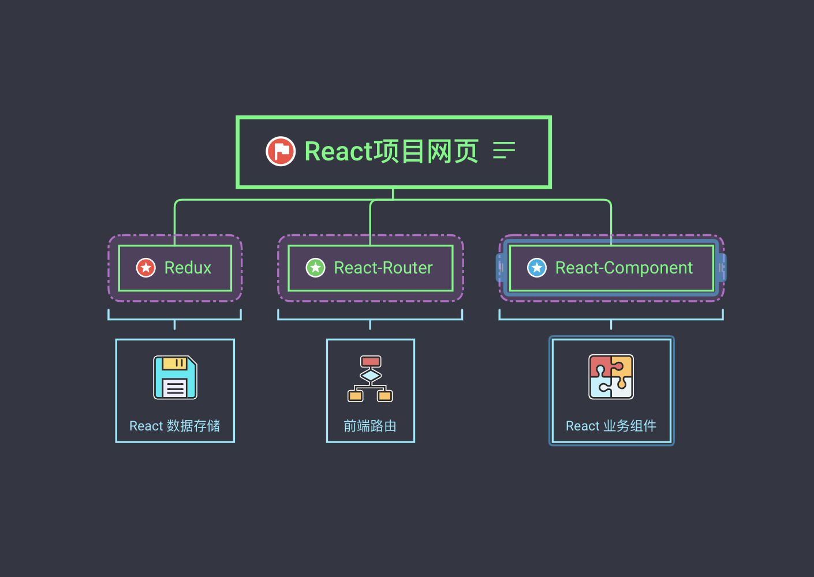

# Webpack+Typescript+React 从 0 到 1

> 开始前: 开发 react 项目，`create-react-app`已经非常好用了，为啥要用`wepack+typescript` 纯属`个人爱好～`, 比较青睐`Typescript` :) 。

- react 项目网页结构图
  - Redux 作为应用的数据存储作用，可以在应用中共享，也可以是持久化的数据
  - React-Router 作为前端应用的路由，负责不同页面之间的跳转，区别于后端实现的路由
  - React-Component 用于呈现网页的不同页面，是前端模块化的体现



## 从零开始

> 废话不多说了，接下来从零开始一步步实现一个`webpack + ts + react`项目, 其中遇到的问题和步骤，我都会记载在 markdown 文件中。

### 初始化项目

项目的前期准备工作，其中会涉及到 git，npm 的相关命令，会注释出来什么意思，就不一一解释了

- 初始化一个 git 仓库

```sh
# git 初始化
$ git init
# 创建 README.md
$ touch README.md
# 创建gitignore文件
$ touch .gitignore
```

- 初始化 npm

```sh
# init
$ npm init
```

- 创建目录结构

```folder
# 项目目录结构
project/
├─ dist/
└─ src/
   ├─ components/
   └─index.js
```

### 安装依赖

- 全局安装 `webpack`

```sh
# npm install
$ npm install -g webpack
```

- 添加`React`和`React-DOM`以及它们的声明文件到`package.json`文件里做为依赖

> 使用@types/前缀表示我们额外要获取 React 和 React-DOM 的声明文件。 通常当你导入像"react"这样的路径，它会查看 react 包； 然而，并不是所有的包都包含了声明文件，所以 TypeScript 还会查看@types/react 包。 你会发现我们以后将不必在意这些。

```sh
# --save 会写入到package.json中的 dependencies
npm install --save react react-dom @types/react @types/react-dom
```

- 添加开发时依赖 awesome-typescript-loader 和 source-map-loader

> awesome-typescript-loader 可以让 Webpack 使用 TypeScript 的标准配置文件 tsconfig.json 编译 TypeScript 代码。 source-map-loader 使用 TypeScript 输出的 sourcemap 文件来告诉 webpack 何时生成自己的 sourcemaps。 这就允许你在调试最终生成的文件时就好像在调试 TypeScript 源码一样。
> 注意我们安装 TypeScript 为一个开发依赖。 我们还可以使用 npm link typescript 来链接 TypeScript 到一个全局拷贝，但这不是常见用法。

```sh
# --save-dev 会写入到package.json中的 devDependencies
$ npm install --save-dev typescript awesome-typescript-loader source-map-loader
```

### 添加 Typescript 配置文件

> 我们想将 TypeScript 文件整合到一起 - 这包括我们写的源码和必要的声明文件。

```json
// tsconfig
{
  "compilerOptions": {
    "outDir": "./dist/",
    "sourceMap": true,
    "noImplicitAny": true,
    "module": "ES6",
    "target": "es5",
    "jsx": "react",
    "lib": ["DOM", "ES2015"],
    "moduleResolution": "Node"
  },
  "include": ["src/**/*"]
}
```

### 简单实践代码

1.在 components 文件夹下创建 hello.tsx 文件，内容如下:

```tsx
import * as React from "react";

export interface HelloProps {
  compiler: string;
  framework: string;
}

export const Hello = (hello: HelloProps) => {
  return (
    <h1>
      Hello from {hello.compiler} and {hello.framework}!
    </h1>
  );
};
```

2.在 src 文件夹下添加 index.tsx 文件，如下所示:

```tsx
import * as React from "react";
import * as ReactDOM from "react-dom";

import { Hello } from "./components/hello";

ReactDOM.render(
  <Hello compiler="Typescript" framework="React"></Hello>,
  document.getElementById("example")
);
```

3.在项目文件夹中添加一个 index.html 文件，内容如下:

```html
<!DOCTYPE html>
<html lang="en">
  <head>
    <meta charset="UTF-8" />
    <meta name="viewport" content="width=device-width, initial-scale=1.0" />
    <title>Typescript React</title>
  </head>

  <body>
    <!-- id和上面index.tsx中对应 -->
    <div id="example"></div>

    <!-- Dependencies 暂时从node_modules中引入，后续可通过cdn等别的方式-->
    <script src="./node_modules/react/umd/react.development.js"></script>
    <script src="./node_modules/react-dom/umd/react-dom.development.js"></script>

    <!-- Main 现在不存在，后续编译出来的js文件，先写个位置-->
    <script src="./dist/bundle.js"></script>
  </body>
</html>
```

### 创建一个 webpack 配置文件

在工程根目录下创建一个 webpack.config.js 文件

> 大家可能对 externals 字段有所疑惑。 我们想要避免把所有的 React 都放到一个文件里，因为会增加编译时间并且浏览器还能够缓存没有发生改变的库文件。
> 理想情况下，我们只需要在浏览器里引入 React 模块，但是大部分浏览器还没有支持模块。 因此大部分代码库会把自己包裹在一个单独的全局变量内，比如：jQuery 或\_。 这叫做“命名空间”模式，webpack 也允许我们继续使用通过这种方式写的代码库。 通过我们的设置"react": "React"，webpack 会神奇地将所有对"react"的导入转换成从 React 全局变量中加载。

```javascript
module.exports = {
  entry: "./src/index.tsx",
  output: {
    filename: "bundle.js",
    path: __dirname + "/dist"
  },
  // Enable sourcemaps for debugging webpack's output.
  devtool: "source-map",
  mode: "development",
  resolve: {
    // Add '.ts' and '.tsx' as resolvable extensions.
    extensions: [".ts", ".tsx", ".js", ".json"]
  },
  module: {
    rules: [
      // All files with a '.ts' or '.tsx' extension will be handled by 'awesome-typescript-loader'.
      {
        test: /\.tsx?$/,
        loader: "awesome-typescript-loader"
      },
      // All output '.js' files will have any sourcemaps re-processed by 'source-map-loader'.
      {
        enforce: "pre",
        test: /\.js?$/,
        loader: "source-map-loader"
      }
    ]
  },
  // When importing a module whose path matches one of the following, just
  // assume a corresponding global variable exists and use that instead.
  // This is important because it allows us to avoid bundling all of our
  // dependencies, which allows browsers to cache those libraries between builds.
  externals: {
    react: "React",
    "react-dom": "ReactDOM"
  }
};
```

### 编译

上面所有的工作就是为了最后这一步，在命令行输入：

```sh
# webpack编译输出dist文件夹中
$ webpack
```

大功告成，打开网页如下图所示 :)


## 项目配置

### 代码规范

> 代码规范，每个公司可能都不一样，添加 tslint 配置你项目的代码规范

1.安装 tslint tslint-react

> 下面使用 yarn 安装，和 npm 使用一致

```sh
# [yarn add] 安装 [--dev] 添加到 package.json devDependencies
$ yarn add tslint tslint-react --dev
```

2.项目目录下创建 tslint.json 可以使用命令: `yarn tslint --init`自动创建一个

```json
{
  "defaultSeverity": "error",
  "extends": ["tslint:latest", "tslint-react"],
  "jsRules": {},
  "rules": {
    "no-console": true,
    "quotemark": [false, "single"],
    "eofline": true,
    "indent": [false]
  },
  "rulesDirectory": [],
  "linterOptions": {
    "exclude": ["node_modules/**"]
  }
}
```

3.启动 tslint 检查并自动 fix

```sh
# 调用tslint
$ yarn tslint -c tslint.json './src/**/*.{ts,tsx}' --fix
```

### 配置 husky 提交时候检查

在 package.json 配置 husky: git commit 和 git push 时候启动 tslint 检查，fix 不过，不能提交(谨慎使用)

`package.json配置如下:`

```diff
{
+  "husky": {
+    "hooks": {
+      "pre-commit": "yarn tslint -c tslint.json './src/**/*.{ts,tsx}' --fix",
+      "pre-push": "yarn tslint -c tslint.json './src/**/*.{ts,tsx}' --fix"
+    }
+  }
}
```

### 编辑器配置

可以修改 vscode 编辑器当前项目的缩进等其他设置，完全看个人爱好，项目目录下增加 `.editorconfig`, 格式类似于 toml
简单配置:

```toml
[*]
indent_style = space
indent_size = 4
insert_final_newline = true
trim_trailing_whitespace = true
charset = utf-8

[*.md]
trim_trailing_whitespace = false
indent_size = 2
indent_style = space

[{package.json,package-lock.json}]
indent_size = 2
indent_style = space

```

## 配置 react 路由

### 添加 react-router history

```sh
# yarn
$ yarn add react-router @types/react-router history @types/history
```

1.添加根路由

```tsx
// Router.tsx
<Route path="/" component={App} exact={true} />
```

2.添加 edit 路由

## Q&A

> [地址](./md/README.md)

收集项目中遇到的问题及解决方案

## 引用

> 本项目过程中参考了以下内容，感谢作者们的分享

- [TypeScript 中文手册](https://typescript.bootcss.com/tutorials/react-&-webpack.html)
